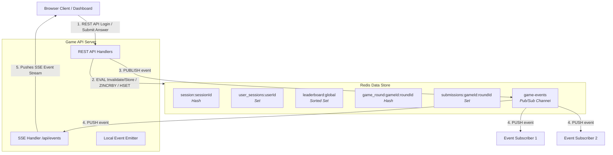

# FlashRank ⚡ Real-Time Quiz Game Leaderboard & Session Store

FlashRank is a high-performance, low-latency backend for competitive, real-time multiplayer quiz games. Built on top of **Node.js (Express)** and powered by **Redis**, the system handles session storage, real-time leaderboard management, and game submission concurrency utilizing atomic Lua scripts, Pub/Sub channels, and Server-Sent Events (SSE).

---

## 🏗️ System Architecture

The following diagram illustrates how the Game API Server, Redis, and client applications interact dynamically:



---

## 🛠️ Tech Stack

* **Core Runtime:** Node.js (>= 18.0.0, ES Modules)
* **Web Framework:** Express.js
* **In-Memory Store:** Redis (using `redis:7-alpine` Docker Image)
* **Redis Client Library:** `ioredis` (providing advanced command pipelining, cluster support, and Lua script execution)
* **Orchestration:** Docker & Docker Compose

---

## 🗄️ Redis Key Schema Design

We adopt the `object-type:id:field` naming convention to avoid namespace collisions and ensure ease of lookup:

| Data Type | Key Pattern | Example Key | Description |
| :--- | :--- | :--- | :--- |
| **Session Data** | `session:{sessionId}` | `session:6f435969-e84c-4d15-bcc9-614ecda441b6` | A Redis Hash storing user session parameters with a 30-minute sliding TTL. |
| **User Sessions Index** | `user_sessions:{userId}` | `user_sessions:u1` | A Redis Set containing all active session IDs for a specific user ID. |
| **Global Leaderboard** | `leaderboard:global` | `leaderboard:global` | A Sorted Set storing player IDs sorted by their cumulative scores. |
| **Game Round State** | `game_round:{gameId}:{roundId}` | `game_round:g1:r1` | A Hash containing round metadata (`endTime`, `correctAnswer`, `points`). |
| **Round Submissions** | `submissions:{gameId}:{roundId}` | `submissions:g1:r1` | A Set tracking player IDs who have already submitted answers for the round. |

---

## ⚡ Atomic Lua Scripts

To prevent race conditions and network round-trip overhead under high concurrency, core operations are handled atomically on the Redis server using Lua scripts:

### 1. Atomic Session Invalidation & Registration
* **Path:** [`src/scripts/invalidateSessions.lua`](file:///c:/GPP/Task26%20-%20Redis%20Real%20Time%20Quiz%20LeaderBoard/FlashRank/src/scripts/invalidateSessions.lua)
* **Behavior:** When a user logs in, the script reads their existing active session IDs from `user_sessions:{userId}`, deletes the corresponding `session:{sessionId}` Hash keys from Redis, registers the new session ID in the set, populates the new session Hash, and sets the TTL to 1800s. All of this executes in a single atomic transaction.

### 2. Atomic Quiz Answer Submission
* **Path:** [`src/scripts/submitAnswer.lua`](file:///c:/GPP/Task26%20-%20Redis%20Real%20Time%20Quiz%20LeaderBoard/FlashRank/src/scripts/submitAnswer.lua)
* **Behavior:** Handles answer processing by verifying if the round has ended (`currentTime > endTime`) and checking if the player has already submitted an answer. If validations pass, the script records the player's submission, calculates points, increments their score on the global leaderboard, and returns the updated score.

---

## 📡 API Reference & Specifications

### Health Check

#### `GET /health`
Verifies API server status and connection to Redis.

* **Response (200 OK):**
  ```json
  {
    "status": "ok"
  }
  ```

---

### Session Management

#### `POST /api/sessions`
Creates a new session and atomically invalidates previous sessions for the user.

* **Request Body:**
  ```json
  {
    "userId": "u1",
    "ipAddress": "192.168.1.1",
    "deviceType": "desktop"
  }
  ```
* **Response (201 Created):**
  ```json
  {
    "sessionId": "ead15e81-f23f-45cd-bbbb-993c868da037"
  }
  ```

---

### Leaderboard

#### `POST /api/leaderboard/scores`
Atomically increments a player's score on the global leaderboard and publishes updates.

* **Request Body:**
  ```json
  {
    "playerId": "alice",
    "points": 50
  }
  ```
* **Response (200 OK):**
  ```json
  {
    "playerId": "alice",
    "newScore": 150
  }
  ```

#### `GET /api/leaderboard/top/{count}`
Retrieves the top N players sorted by score descending.

* **Response (200 OK):**
  ```json
  [
    { "rank": 1, "playerId": "bob", "score": 200 },
    { "rank": 2, "playerId": "diana", "score": 180 },
    { "rank": 3, "playerId": "alice", "score": 150 }
  ]
  ```

#### `GET /api/leaderboard/player/{playerId}`
Retrieves a player's stats, ranking, outperforming percentile, and adjacent neighbors (above/below).

* **Response (200 OK):**
  ```json
  {
    "playerId": "alice",
    "score": 150,
    "rank": 3,
    "percentile": 50.0,
    "nearbyPlayers": {
      "above": [
        { "rank": 1, "playerId": "bob", "score": 200 },
        { "rank": 2, "playerId": "diana", "score": 180 }
      ],
      "below": [
        { "rank": 4, "playerId": "eve", "score": 120 },
        { "rank": 5, "playerId": "frank", "score": 90 }
      ]
    }
  }
  ```

---

### Game Logic

#### `POST /api/game/rounds`
Helper endpoint to seed a quiz round metadata.

* **Request Body:**
  ```json
  {
    "gameId": "g1",
    "roundId": "r1",
    "correctAnswer": "Paris",
    "points": 50,
    "durationMs": 60000
  }
  ```
* **Response (201 Created):**
  ```json
  {
    "message": "Round seeded successfully",
    "roundKey": "game_round:g1:r1",
    "endTime": "2026-06-27T05:20:00.000Z"
  }
  ```

#### `POST /api/game/submit`
Atomically validates and submits an answer for a quiz round.

* **Request Body:**
  ```json
  {
    "gameId": "g1",
    "roundId": "r1",
    "playerId": "alice",
    "answer": "Paris"
  }
  ```
* **Response (200 OK - Success):**
  ```json
  {
    "status": "SUCCESS",
    "newScore": 200
  }
  ```
* **Response (400 Bad Request - Duplicate Submission):**
  ```json
  {
    "status": "ERROR",
    "code": "DUPLICATE_SUBMISSION"
  }
  ```
* **Response (403 Forbidden - Expired Round / Closed Window):**
  ```json
  {
    "status": "ERROR",
    "code": "ROUND_EXPIRED"
  }
  ```

---

### Real-time Event Streaming

#### `GET /api/events`
Establishes a Server-Sent Events (SSE) connection pushing game updates in real-time.

* **Response Headers:** `Content-Type: text/event-stream`
* **Event Format:**
  ```http
  event: leaderboard_updated
  data: {"playerId":"alice","newScore":150}
  ```

---

### Administrative Tools

#### `GET /api/admin/sessions/user/{userId}`
Retrieves active session details for a user.

* **Response (200 OK):**
  ```json
  [
    {
      "sessionId": "ead15e81-f23f-45cd-bbbb-993c868da037",
      "ipAddress": "192.168.1.1",
      "lastActive": "2026-06-27T05:15:19.000Z",
      "deviceType": "desktop"
    }
  ]
  ```

#### `DELETE /api/admin/sessions/{sessionId}`
Forces the deletion and invalidation of a specific session.

* **Response (204 No Content)**

---

## 🚀 Execution & Setup Guide

### Running via Docker Compose (Recommended)
This starts all required services (Express server and Redis server) consistently in a container network.

1. Ensure Docker and Docker Compose are installed.
2. Clone the repository and enter the root directory:
   ```bash
   git clone https://github.com/MouliSaiDeep/flash-rank.git
   cd flash-rank
   ```
3. Copy configuration defaults:
   ```bash
   cp .env.example .env
   ```
4. Build and start the services in detached mode:
   ```bash
   docker compose up --build -d
   ```
5. Confirm containers are healthy:
   ```bash
   docker compose ps
   ```

---

### Running Locally (Without Docker)
1. Ensure Node.js (>= 18) and a Redis Server (>= 6.2) are installed locally.
2. Ensure local Redis is running:
   ```bash
   redis-cli ping
   # Should return PONG
   ```
3. Copy configuration and configure variables:
   ```bash
   cp .env.example .env
   ```
   *(Ensure `REDIS_URL` in `.env` matches your local Redis connection details, e.g. `redis://localhost:6379`)*.
4. Install dependencies:
   ```bash
   npm install
   ```
5. Start the application:
   ```bash
   npm start
   ```

---

## 🧪 Verification & Testing

Both validation suites run internally inside the `flashrank-api` container to assert endpoints and data integrity.

* Run the JavaScript verification tests:
  ```bash
  docker exec flashrank-api node /app/verify.mjs
  ```
* Run the Shell curl verification tests:
  ```bash
  docker exec flashrank-api sh /app/verify.sh
  ```
